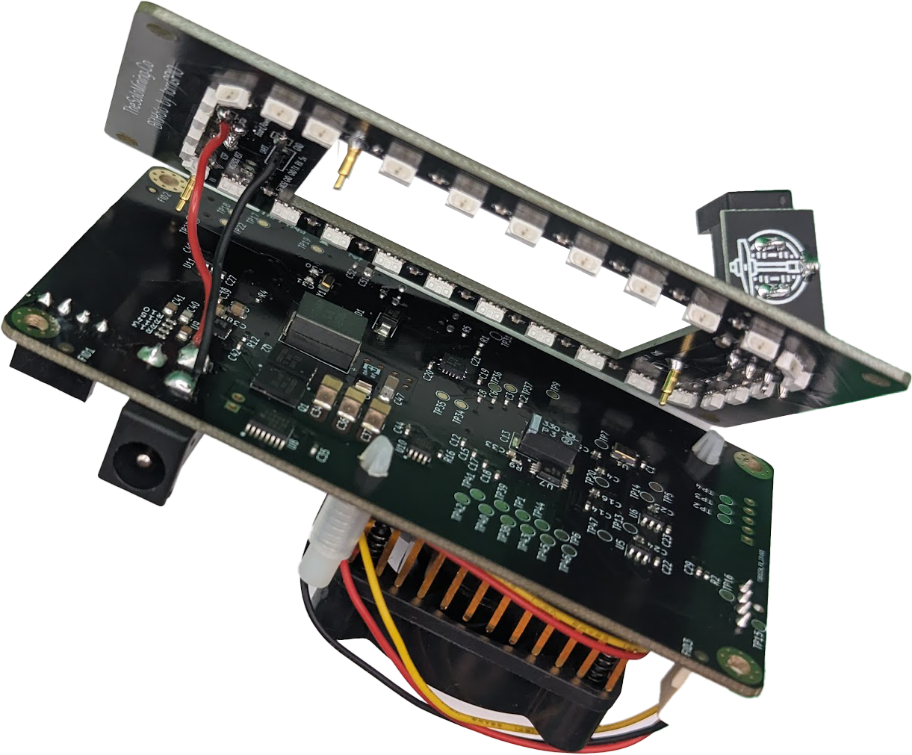

### The BitHalo 201-204 by IAmGPIO of www.thesolomining.co

In the grand tapestry of the cosmos, where stars weave the stories of fate and fortune, the Almighty leaned over to the legendary IAmGpio, whispering through the winds of time, __'Let there be light.'__ With a smirk as wide as the horizon and the casual air of a cosmic pub regular, IAmGpio, the electric alchemist, declared with a mischievous twinkle, 'Hold my beer...' And thus, amidst a backdrop of chuckling constellations, the darkness scurried away, leaving behind a spectacle to be remembered.

During this celestial extravaganza, as the light began to weave and dance through the fabric of space, the Almighty paused, squinted through the cosmic kaleidoscope, and in a moment of divine epiphany, exclaimed in a cockney accent that resonated across the heavens, _'Oi, hold up, this looks a bit like a halo, don’t it?'_ The cosmos held its breath, the stars blinked in amusement, and in that whimsical pause, BitHalo was born. With a hearty chuckle and a nod of approval, the Lord mused, 'Well, ain’t that brilliant? BitHalo it is, then!' And the universe, in all its wonder and wit, echoed with laughter, forever cherishing the birth of BitHalo, a light that forever wears its halo with a determined grin, proving its sidekick, The Bitaxe's best efforts, to find that elusive block.

-Ok, this didn't happen _**exactly**_ like this. 

***   
### Anyway...!   

The BitHalo is a daughter board for the Bitaxe (https://bitaxe.org/) and is designed to fix to the rear of the Bitaxe with almost zero technical skill required.
Every time the Bitaxe submits a share to the pool, a pulse of light is emitted from the BitHalo. 

The BitHalo has an in-built ATMEGA328P chip (Arduino) with code uploded to simply read the debug serial data coming from a test pint (TP18) on the rear of the Bitaxe. When the serial string "accepted" is detected, the function "pulseLeds" is run.

The same applies to "BLOCK FOUND" (that would be nice, would't it!)
***

### The LEDS & Switch on the BitHalo:
On the BitHalo are 30 x RGB side emitting leds (WS protocol). Each LED is individually addressable.
Future revisions of the arduino sketch (BitHalo's firmware) could allow so much more animation options based on the serial stream.

On the BitHalo is a slide switch. This switch simply disables the LED lights on the BitHalo. Turning the LEDs off does not affect the function of the Bitaxe itself. It is just there to turn the ligths off if they annoy you at night or whatever.

 

***

### The External DC Jack (Do not use if using Bitaxe version 204):
The external DC jack that solders to the rear of the BitHalo was incorporated to allow the Bitaxe to be powered from the rear as opposed to being powered by the DC jack on the side. 

It involved soldering 2 wires on the rear of the BitHalo v201 to the rear of the DC jack on the Bitaxe (must be capabale of carrying at least 4a of current). Whilst this worked well on Bitaxe v201, I had to omit it for the v204 rollout due to the change in architecture and the way the DC jack was soldered on to the board. V201 had a through hole DC jack and 204 had a surface mount (SMD) variant which meant I couldnt solder on to the pins on the rear.

__Note:__ V205 of the Bitaxe has specific pads for accessories such as the BitHalo. On this, there will be new version of the BitHalo (in due course) which should work with all future versions of the Bitaxe, including the 400 series - "The Supra".

   
   

***
### The 3d Printed Diffuser:
To diffuse the pixellation from the individual LED's, I have designed a 5mm thick 3d printed opaque/opal diffuser.
This simply prints in 100% infill. File can be found in the "3d Print Files" above. If the 3d printed diffuser fouls any of the components on the Bitaxe or BitHalo, it means the diffuser is the wrong way round!

 

***
### The 3d Printed Stand:
In the 3D print file set above, you will find the left and righ sides of the stand I have designed to work with the BitHalo + v201-v204 of the Bitaxes. Careful consideration has been made with regards to the small components on the BitHalo and Bitaxe itself. The stand, nor the diffuser, should foul any components. 

***

### The Code & updating the BitHalo
As I only know what I know, I have written all of the code in Arduino using the Arduino IDE (sorry about that). The BitHalo can be updated via a "USBasp Programmer" (a few bucks online). On the rear of the BitHalo, you will see the 6 ICSP holes. You connect your USBasp programmer (using 5v) to the 6 pins on the BitHalo. 

When programming via the Arduino IDE, you must click "update using programmer", not the usaul "upload" button.
The processor on the BitHalo is the ATMega328p.

If you are flashing the BitHalo in situ (already on the Bitaxe), flick the switch to the off position as this will isolate the BitHalo from the Bitaxe and allow you to power the BitHalo without also trying to power the Bitaxe via the ICSP pins (bad JuJu if this happens).

### The Assembly:
You will need 4 x (M14 x M3) self tapping screws. The scews simply pass through the Bitaxe, the diffuser, the BitHalo and then finally, into the stands. The 3 x gold pogo pins on the BitHalo will align to the  3 necessary pads on the Bitaxe. Everything self aligns providing you use the correct screws.

 
